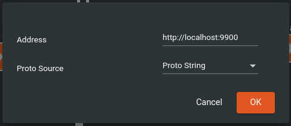

This document will show you how to quickly get set up using a simple example that takes a list of items containing a
time and two values, and returning a list of items containing the same given time and the average of the two values.

The documentation for using gRPC in Python can be found [here](https://grpc.io/docs/languages/python/)
if you would like more information.

To create a remote module in Python (or adapt existing Python code to be run in dDock), you need to start by adding the
necessary packages to implement a gRPC server. The packages used in this example are:

- ```grpcio``` @ 1.42.0
- ```grpcio-tools``` @ 1.42.0

With these packages installed, you can now create a proto file describing what methods your code provides and what their
inputs and outputs look like. You can see the proto file provided in this example [here](example.proto).

Now that your proto file is created, you need to run the proto compiler to generate the Python classes you'll use to set
up your service. This is contained in the ```grpcio-tools``` package that you should have previously installed. For this
example, you can run

```bash
python -m grpc_tools.protoc -I./ --python_out=. --grpc_python_out=. ./example.proto
```

in the directory containing example.proto and main.py and it will automatically generate two additional Python files for
you: example_pb2.py and example_pb2_grpc.py.

With the needed packages installed and the proto file compiled, you can now run the example. The code for this simple
example that averages two values and writes them back with their associated time can be found [here](main.py) or below:

```python
import grpc
from concurrent import futures
import example_pb2
import example_pb2_grpc


class Example(example_pb2_grpc.ExampleServicer):
    def Average(self, request_iterator, context):
        for request in request_iterator:
            values = map(
                lambda d: example_pb2.OutputDatum(DateTime=d.DateTime, Value=(d.Value1 + d.Value2) / 2),
                request.Data
            )
            output = example_pb2.Output()
            output.Data.extend(values)
            yield output


def serve():
    server = grpc.server(futures.ThreadPoolExecutor())
    example_pb2_grpc.add_ExampleServicer_to_server(Example(), server)
    server.add_insecure_port('[::]:9900')
    server.start()
    server.wait_for_termination()


if __name__ == '__main__':
    serve()
```

<br/>

With the gRPC service running you can now connect to it in dDock using the "Remote Module" module in Packages.Remote.
For this example, the settings you'll want to choose when you drag it onto the drawing board are:

1. Change the "Proto Source" field to "Proto String" since this simple example server does not support the "Server
   Reflection" option.<br/>
   
   <br/><br/>

2. Copy the text from example.proto and paste it into the text area:
   
   <br/><br/>

3. Since "Average" is the only method provided by this server, it will be the default and you can just press OK.
   
